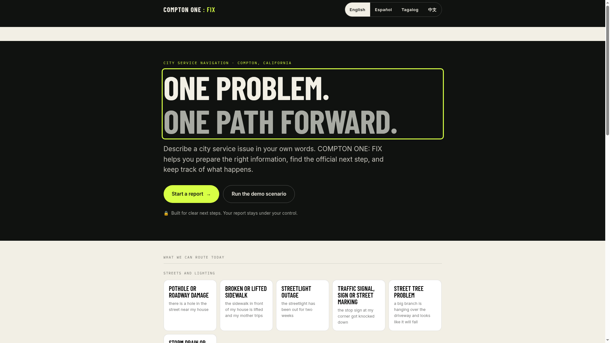
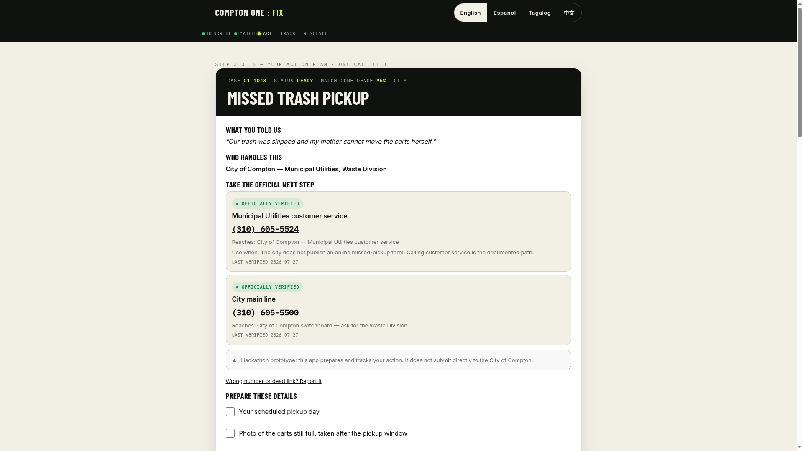
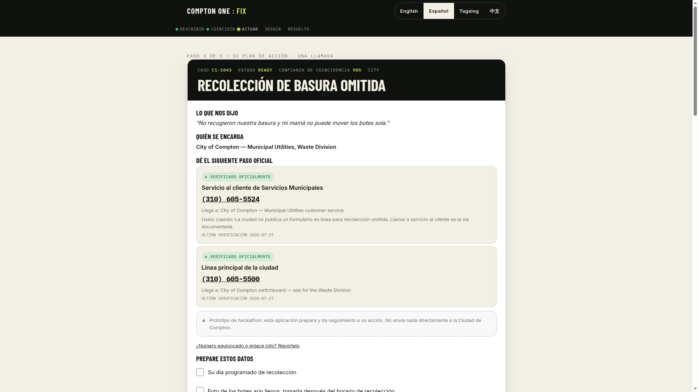

# COMPTON ONE: FIX

**One problem. One path forward.**

A civic service navigation prototype for Compton, California, with a four-language
interface (English, Español, Tagalog, 中文). A resident describes a city service
problem in plain language; the app identifies the correct department from a catalog
of **22 verified city service routes**, lists the evidence to gather, hands off to
the official channel with a prepared call script and ready-to-send message, issues
a **Civic Action Receipt** with a **one-tap submission action** (wave 4), and
tracks the case to a recorded outcome.

**22 routes catalogued and routed.** Each carries a verified phone number or URL,
the responsible department, and a `verificationState` (`officially_verified` or
`needs_confirmation`) sourced directly from official City of Compton pages on
2026-07-27. The catalog finding that justifies this product: **13 of 22 routes
have no dedicated online intake form at all** — they are phone-only barriers for
residents who work business hours or who are Deaf or hard of hearing.
Every receipt shows the verification date and a one-tap "wrong number or dead
link? Report it" channel, because a stale number is a broken promise.

**How routing works (two deterministic passes, no LLM anywhere):**
1. The tested engine (`bundle.js`) scores the description against its keyword
   tables — a core tier tuned for the five most common services plus an extended
   tier covering the rest of the catalog — and handles the emergency gate.
2. If — and only if — the engine returns *unsupported*, the controller's
   **scenario engine** (patch R-01) scores the description against ~30 plain-language
   phrase groups (EN/ES, strong/medium/weak) covering all 22 services, and routes
   or asks an either/or question. Before both passes, a curated rewrite table
   (patch R-02) repairs common typos and phrasing variants ("pot hole", "grafitti",
   "lost my dog"), and an order-free word-set scorer catches interpolated phrasing.
   Low-confidence routes carry one-tap "not quite right?" alternates on the receipt.
   Every path can only emit known catalog IDs; when nothing matches, the app says
   so honestly, with the verified city main line.

> **Scope:** This prototype prepares and tracks a resident's action. It does not
> submit anything to the City of Compton. That limit is stated on the landing page,
> on every receipt, and in the footer.

---

## See it

**Live:** [compton-one.vercel.app](https://compton-one.vercel.app) — built phone-first.

| Landing — 22 services, 4 languages | Civic Action Receipt | El recibo — en Español |
|---|---|---|
|  |  |  |

### Demo video

**[▶ Watch the 45-second guided journey](compton-one-demo.mp4)** — landing →
describe → Civic Action Receipt → Español → save → track → privacy panel.

The same journey, live: **[compton-one.vercel.app](https://compton-one.vercel.app)**
→ press "Run the demo scenario".

---

## Run it — no build, no server

```
open index.html        # or compton-one-fix.html — same page
```

The page loads `bundle.js` (the tested, compiled TypeScript engine), `app.js`
(controller part 1: state, strings, routing), `app.langs.js` (Tagalog + 中文
language pack and bundle-boundary patches), `app.ui.js` (controller part 2:
receipt, timeline, dashboard, boot) and `app.send.js` (verified submission
channels + send block) from the same folder — **keep the six files together**.
No server, no network calls, no account.

Press **Run the demo scenario** for the 60-second guided path.

---

## Verify it

```bash
bash scripts/build-check.sh     # pre-deploy gate: files, syntax, scripts, palette
npm install
npx vitest run                  # unit tests (requires lib/ sources — see note below)
npx tsc --noEmit                # strict TypeScript (requires lib/ sources)
python3 verify.py               # browser-journey checks (requires playwright)
python3 scripts/verify-channels.py   # wave 5: re-verify official submission channels
```

> **Repo note (2026-07-28):** the `lib/` TypeScript sources and the filled test
> files were never committed — only their compiled output (`bundle.js`) is in the
> repo. `bundle.js` is committed verbatim and loaded as-is; treat it as the
> source of truth for the engine until `lib/` is rebuilt. `npm run build` will
> fail without `lib/`; the HTML does not depend on it.

---

## Layout

```
index.html              Entry point — loads all five scripts (bundle + 4 controllers)
compton-one-fix.html    Same page, legacy name (kept for existing links)
app.template.html       Markup + design system (source for the HTML)
app.js                  Controller part 1 — state, strings, routing (no build step)
app.langs.js            Language pack — tl/zh chrome, catalog titles, bundle-boundary patches
app.ui.js               Controller part 2 — receipt/timeline/dashboard/boot
app.send.js             Wave 4 — verified submission channels + send block
entry.ts                TypeScript entry point; exports C1 to window
bundle.js               esbuild output of entry.ts + lib/ (committed, loaded as-is)
verify.py               Browser checks (requires playwright)
scripts/build-check.sh  Pre-deploy gate (mirrors CI)
scripts/verify-channels.py  Wave 5 — channel drift tripwire
tests/                  Unit tests (stubs — lib/ sources not yet committed)
media/                  Architecture, journey, before/after, title, teaser
shots/                  Screenshots produced by verify.py
wave-6_Compton- one-逻辑/brand-assets/  Brand images (OG card + favicon/touch icons);
                        copied into public/ by vercel-build — uploaded via web UI
docs/
  SERVICE-CATALOG.md    22 verified city service routes (source of truth)
  ARCHITECTURE.md       Design decisions and security model
  SPEC.md               Original design spec (2026-07-27, historical — this README is current)
  ROADMAP.md            Waves shipped + ranked backlog
  HOW-IT-WORKS.md       Plain-language walkthrough of the platform
  REPLICATE.md          Stand this up for your own city
  HACKATHON.md          The pitch — problem, demo, differentiators
```

---

## Controller patches — 2026-07-28 (wave 3)

All engine code (`bundle.js`) is untouched. Changes live in `app.js`, `app.ui.js`,
`app.langs.js` and `app.template.html`, marked with `CONTROLLER PATCH` or wave
comments:

- **Four-language interface (EN/ES/TL/ZH).** Full chrome translation for Tagalog
  and Simplified Chinese, layered over English as a fallback so an untranslated
  string can never render as a raw key. Receipts, emergency guidance and calendar
  files exist in EN/ES only (the city's working languages) — the language pack
  coerces those at the bundle boundary and the UI says so honestly instead of
  silently switching. Catalog service titles are translated; intake matching
  stays EN/ES and the Tagalog/中文 hint text says that up front.
- **W-01 — voice removed.** Voice input depended on the browser vendor's speech
  service: hard-blocked on Brave, quietly proxied on Chrome, and a gimmick for
  the residents who most needed a reliable path. It is gone entirely — button,
  module, permission copy. Typing is the one honest input method.
- **R-02 — routing tolerance.** A curated, deterministic rewrite table repairs
  common typos and variants ("pot hole", "grafitti", "trafic light", "lost my
  dog"); an order-free word-set scorer catches interpolated phrasing in the
  scenario pass; routed results now carry `alternates`, surfaced on the receipt
  as one-tap re-routes when confidence is not near-certain.
- **W-02 — save confirmation feedback + dedupe.** Saving used to give zero
  visible feedback, so residents clicked repeatedly — seven silent re-saves in
  one session inflated the funnel and burst a bar clean out of the privacy card.
  Now: inline confirmation / empty / already-saved messages, and repeat saves
  of the same number are acknowledged but not re-tracked.
- **W-03 — privacy panel redesign.** Raw analytics tokens ("confirmation_saved
  service_id=...") read as leaked backend scripts. The panel now shows friendly
  translated event names, service titles instead of IDs, consecutive repeats
  collapsed to ×n, funnel bars as percentages of the true maximum (they can
  never overflow the card), and the raw token stream behind a collapsible
  "technical log" for auditors.
- **W-04 — receipts that act.** One-tap email draft (opens the resident's own
  mail app with the message written; the app still never sends anything),
  one-tap copy of the call script, and the existing print/calendar actions.
- **W-05 — catalog trust layer.** Every receipt shows the verification date per
  contact method and a prefilled "wrong number or dead link? Report it" issue
  link; the footer carries the same channel. Stale contact data is a when, not
  an if — the repair path is now built in.
- **W-06 — contrast + mobile.** The active journey step rendered ink-on-night
  (invisible); fixed. Media queries at 560px/380px: full-width actions, denser
  tiles, two-column stats, language pills sized for small screens. Stale
  "22 services" copy is now derived from the live catalog everywhere.
- **R-03 — dynamic counts.** Landing "how it works" and the unsupported wall
  derive the service count from `C1.SERVICE_IDS.length` — copy cannot go stale
  when the catalog changes.

Waves 1–2 (same day, earlier): R-01 scenario engine · V-01/V-02/V-03 voice
honesty (superseded by W-01 removal) · C-01 debris guard · P-01/P-02/P-03
pathway · M-01 Message Studio · C-02 Google Calendar · J-01 outcome-named
journey · D-01/D-02 palette · B-01 dead-button feedback · print blank-page fix.

---

## Wave 4 — closing the loop: verified submission channels (2026-07-29)

Every route now carries a **verified official submission channel**, researched
from official sources only (comptoncity.org, republicservices.com,
pticket.com/compton, sce.com — accessed 2026-07-29), and every receipt gains a
**"Send your report"** block that uses it:

- **7 official online forms** (comptoncity.org → I Want To → Report): illegal
  dumping, graffiti, code violations, animal control, street-light outage
  (city-owned), power outage, plus parking citations (pticket.com/compton).
  The receipt deep-links the form and tells the resident to paste the Message
  Studio text in.
- **13 official published email addresses** (Public Works `contactpw@`,
  Waste `contacttrash@`, Water `cwdcd@`, Housing `contactlh@`, City Clerk
  `contactcityclerk@` — corrected from `contactcc@` in wave 5, see below —
  Business License `contactbl@`; all @comptoncity.org). The
  receipt's one-tap email draft now carries the verified To address and the
  exact message the resident sees.
- **1 honest phone-only route** (abandoned vehicles): no official written
  channel could be verified, so the receipt says that instead of inventing one.
- The official **City of Compton app** (comptoncity.org/services/compton-app)
  is referenced as a secondary channel for street maintenance.

Implementation: a self-contained module, `app.send.js` (5th script), that wraps
`X.renderReceipt` and `window.emailDraft` from the outside — zero edits to
`bundle.js`, `app.js`, `app.langs.js`, `app.ui.js`. The channel map is exposed
as `C1X.SUBMISSION_CHANNELS`. Doctrine holds: **the app never sends anything
itself** — the resident always presses send, and the block says so in all four
languages. `verify.py` now runs 37 checks (32 wave-3 + 5 wave-4), all PASS.

---

## Wave 5 — catalog trust pipeline (2026-07-29)

The verified catalog is an asset and a liability: one stale channel quietly
breaks trust with exactly the resident who needed it most. This wave converts
the quarterly manual catalog review into an always-on tripwire.

- **`scripts/verify-channels.py`** — re-fetches every channel's official
  source (form URLs directly; the official city pages that publish each email —
  CivicPlus hides addresses behind `mailto:` "Email" links, so raw markup is
  searched, not rendered text). A real page that lost the address = drift
  (exit 1 + Markdown report); a bot-wall challenge page = inconclusive and
  retried, never auto-failed. `--update-date` bumps the in-app verification
  date after a fully clean pass.
- **Per-channel `src` registry** on `C1X.SUBMISSION_CHANNELS` — every channel
  declares the official page(s) that publish it; the checker parses the map
  straight out of `app.send.js` (single source of truth, no drift between
  data and checker).
- **Honest aging on the receipt** — `X.SUBMISSION_VERIFIED` is exposed; past
  45 days the send block warns that re-verification is due instead of silently
  showing an old "verified" stamp.
- **First catch, applied same-day** — the official City Clerk page no longer
  publishes `contactcc@`; it now shows `contactcityclerk@comptoncity.org`.
  The `public_records` channel is corrected in this wave. This is the pipeline
  working as designed.
- **Weekly CI** (`.github/workflows/channel-verify.yml`, added via web UI —
  the bot token lacks the `workflow` scope) runs the checker on a schedule and
  opens a GitHub issue with the report when a channel drifts.

`verify.py` now runs **40 checks** (37 + 3 wave-5), all PASS.

---

## Wave 6 — brand: social sharing, favicon, mobile icons (2026-07-29)

The link is the demo — most people will meet this project as a pasted URL.
Wave 6 makes that first impression carry the brand:

- **Open Graph + Twitter card meta** on both entry points (and the template):
  `og.jpg` (1200×630), absolute `compton-one.vercel.app` URLs,
  `summary_large_image`, meta description, `theme-color` matching `--night`.
- **Icons** derived from the project logo: `favicon-32.png`,
  `apple-touch-icon.png` (iOS home screen), `icon-192.png` (Android/PWA).
- **Deploy wiring** — `vercel-build` copies the four images into `public/`;
  `scripts/build-check.sh` gained a brand gate (step 7) that fails the build
  if the OG wiring or assets go missing.
- The OG description states the honest scope: the app routes residents to the
  verified official channel — it never submits to the city.

`verify.py` now runs **41 checks** (40 + 1 brand), all PASS.

---

## The 22 catalogued routes

All 22 routes are sourced, verified, and documented in
[`docs/SERVICE-CATALOG.md`](docs/SERVICE-CATALOG.md) — and all 22 are reachable
today: through the tested engine's keyword tables, backed by the R-01 scenario
engine, with an honest unsupported wall (and the verified main line
`(310) 605-5500`) when nothing matches.

Illegal dumping · pothole · streetlight outage · missed trash pickup · water or
sewer · graffiti · abandoned vehicle · sidewalk · street tree · traffic
signal/sign · storm drain & flooding · bulky item pickup · recycling & e-waste ·
animal control · code/property violation · housing help · parking citation ·
utility billing · business licence/permit · public records · power outage ·
homeless outreach.

---

## Architecture in one paragraph

There is **no model in the routing path.** Classification is deterministic keyword
and phrase scoring with word-boundary matching in English and Spanish, in two
passes (tested engine, then controller scenario net), fronted by a curated typo
table. All paths can only emit known service IDs; a type guard and
`getRouteOrThrow` reject anything else. The emergency gate cannot be argued out
of firing. This is why prompt injection cannot produce a fabricated department.

See [`docs/ARCHITECTURE.md`](docs/ARCHITECTURE.md) for the full design rationale.

---

## Rebuild after editing `app.template.html`

The HTML is assembled by replacing five placeholders:

```bash
python3 - <<'EOF'
import pathlib
t = pathlib.Path('app.template.html').read_text()
out = (t.replace('<script>\n/*__BUNDLE__*/\n</script>', '<script src="bundle.js"></script>')
        .replace('<script>\n/*__APP__*/\n</script>', '<script src="app.js"></script>')
        .replace('<script>\n/*__APPLANGS__*/\n</script>', '<script src="app.langs.js"></script>')
        .replace('<script>\n/*__APPUI__*/\n</script>', '<script src="app.ui.js"></script>')
        .replace('<script>\n/*__APPSEND__*/\n</script>', '<script src="app.send.js"></script>'))
pathlib.Path('compton-one-fix.html').write_text(out)
pathlib.Path('index.html').write_text(out)
EOF
```

(`npm run build` still documents the original inline-bundle pipeline; it requires
the uncommitted `lib/` sources and is not needed for deployment.)

---

## What is simulated, and labelled as such

SMS reminders · city acknowledgment · four dashboard demo cases.

## What is deliberately not built

Emergency dispatch · direct city submission · ID collection · payments ·
public accusations · named-offender reporting · minor profiles · predictive
policing · guaranteed response times.

## Permissions this app requests

**None.** No microphone, camera, location, contacts, or network calls of its
own. (Voice input was removed in wave 3 — typing is the single, identical path
on every browser.)

The only writable surface is `localStorage`, and only after explicit resident
opt-in on the receipt screen — one key, on that device, never sent anywhere,
erased completely by a single control.
