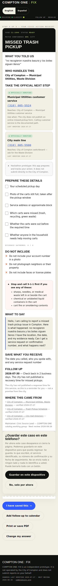
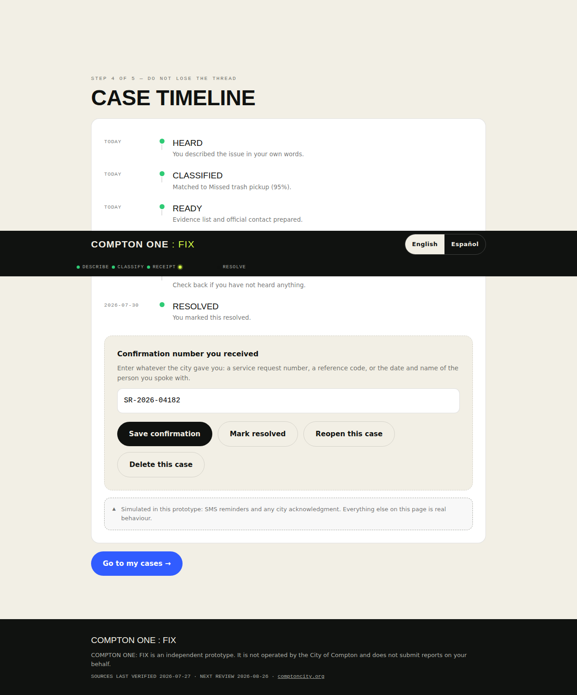
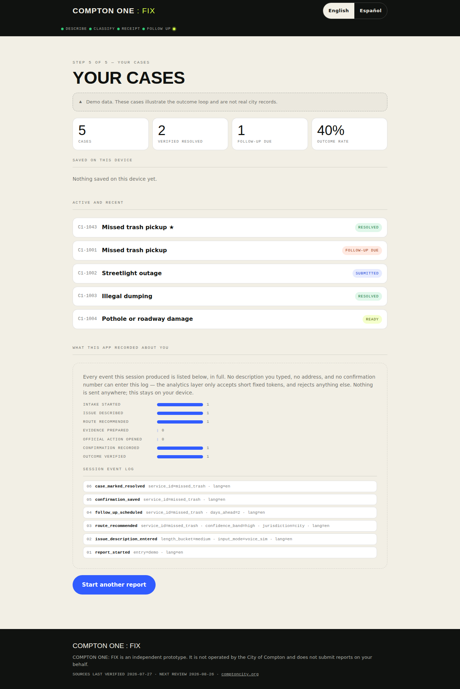
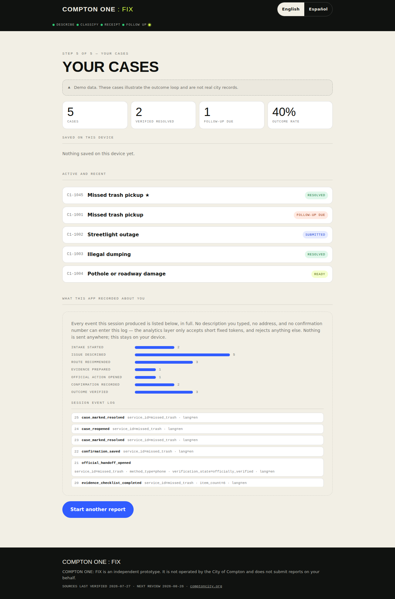
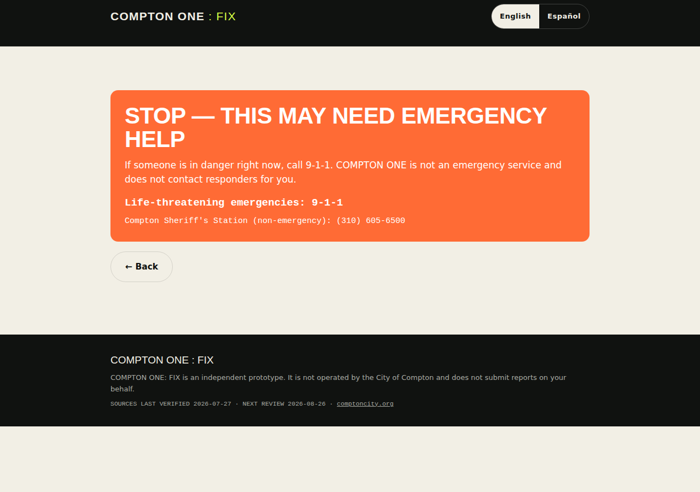
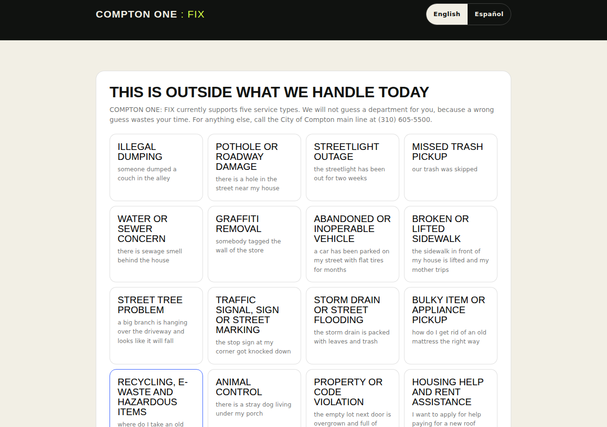

# How to use COMPTON ONE : FIX

No account. No app store. Works on a phone or a laptop.

**Live app:** [https://compton-one.vercel.app](https://compton-one.vercel.app)
**Video (45 seconds):** [compton-one-demo.mp4](https://github.com/DigitalCurrensy/compton-one/blob/main/compton-one-demo.mp4)

---

## 60-second path

1. Open the live site.
2. Press **Run the demo scenario** — or **Start a report** and type your own words.
3. Read the Civic Action Receipt.
4. Call, open the city form, or send the email yourself.
5. Optionally keep the case on this phone and mark it resolved later.

---

## Screen by screen

### Landing


What you see:

- Language pills: English · Español · Tagalog · 中文
- **Start a report** — type what happened
- **Run the demo scenario** — guided walkthrough with sample text
- Service tiles grouped by theme (streets, waste, housing, and the rest of the 22)

Tap a tile if you already know the category. Otherwise just start a report.

---

### Step 1 — Describe

Headline on this screen: **You do not need to know the department.**

Type the problem the way you would tell a neighbor.

Examples already on the page:

- our trash was skipped
- the streetlight has been out for two weeks
- someone dumped a couch in the alley
- there is a hole in the street near my house

Do not include names, license plates, or accusations about a specific person. Describe what you saw.

Matching works best in English or Spanish. Tagalog and 中文 translate the buttons and labels; the hint on those screens says so.

Then tap **Find the right path**.

---

### Step 3 — Civic Action Receipt


This is the page you came for. A missed-trash example includes:

| Block | What it gives you |
|---|---|
| Case id | e.g. `C1-1043` |
| Who handles this | City of Compton — Municipal Utilities, Waste Division |
| Official next step | Verified phone `(310) 605-5524`, with last-checked date |
| Backup | City main line `(310) 605-5500` |
| Evidence checklist | Pickup day, photo of the carts, which carts were missed |
| Call script | The words to say |
| Send block | Opens *your* mail app with the message already written |
| Repair link | Wrong number or dead link? Report it |

The app prepares the action. You still press send, or you still place the call.

#### Same receipt in Español


Switch languages any time from the header. Department names stay official; the chrome and scripts translate.

#### Same receipt on a phone



Built phone-first: full-width actions, tap-to-call numbers, save / calendar / print / PDF.

---

### Step 4 — Timeline



After you act:

- Paste the confirmation number the city gave you (`SR-2026-04182` in the demo)
- **Save confirmation**
- **Add follow-up to calendar** (Google Calendar or a `.ics` file)
- **Mark resolved** or **Reopen this case**
- **Delete this case**

SMS reminders and a city “we got it” note are labeled **simulated** on this screen. Everything else here is real behavior on your device.

---

### Step 5 — Your cases and privacy log



The dashboard lists cases saved on this device and a privacy panel that proves what little was recorded.

The log only accepts short fixed tokens (`route_recommended`, `confirmation_saved`). Your description, address, and confirmation number cannot enter it. Nothing in that panel is sent anywhere.



Four sample rows on first load are labeled **Demo data**. They are not city records.

---

## Two screens that protect you

### Emergency gate



If the words look like a life-threatening emergency, the app stops.

- **9-1-1** for danger happening now
- Compton Sheriff non-emergency: **(310) 605-6500**

COMPTON ONE is not an emergency service and does not contact responders.

### Honest miss



If the words do not match a catalogued service, the app does not guess. It shows the services it *can* route and the city main line **(310) 605-5500**.

---

## Languages

| Language | Buttons and labels | Typed matching |
|---|---|---|
| English | Full | Full |
| Español | Full | Full |
| Tagalog | Full | Use English or Spanish for the description |
| 中文 | Full | Use English or Spanish for the description |

Receipts and call scripts used with the city stay in English or Spanish — those are the city's working languages. The UI says so instead of silently switching.

---

## What you should not put in the box

- Other people's names
- License plates
- Accusations about a specific person
- Photos of neighbors or their property
- Your utility account number in a screenshot you plan to share

Describe the condition. Leave identity out.

---

## Run the same flow on your computer

```bash
git clone https://github.com/DigitalCurrensy/compton-one.git
cd compton-one
open index.html
```

Keep `index.html`, `bundle.js`, `app.js`, `app.langs.js`, `app.ui.js`, and `app.send.js` in the same folder.

---

## More

- Product logic: [HOW-IT-WORKS.md](HOW-IT-WORKS.md)
- Official contacts: [SERVICE-CATALOG.md](SERVICE-CATALOG.md)
- What is stored: [DATA.md](DATA.md)
- Another city: [REPLICATE.md](REPLICATE.md)
